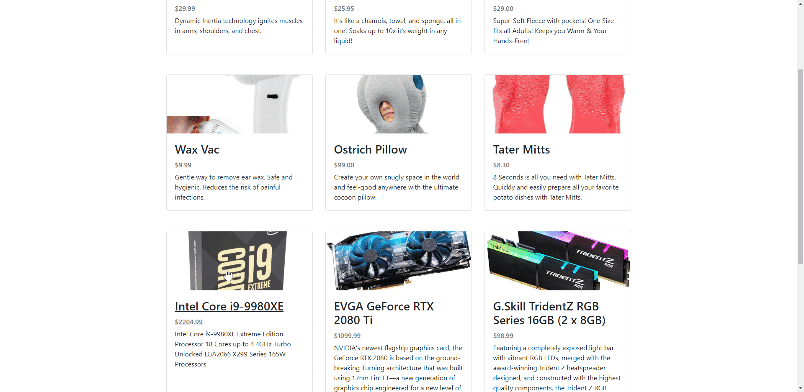

# E-Commerce Site Fullstack
A full-stack e-commerce website that lets the user view, add, and remove items from a shopping cart and place an order
## Technologies Used
|             Dependency             |   Version   |
|------------------------------------|------------:|
| @Babel/Core                        |    7.8.7    |
| @Babel/Plugin-Transform-React-JSX  |    7.8.3    |
| Babel-Loader                       |    8.0.6    |
| Bootstrap                          |    4.3.1    |
| CORS                               |    2.8.5    |
| Dotenv                             |    8.2.0    |
| Express                            |    4.17.1   |
| Express-Session                    |    1.17.0   |
| FontAwesome                        |    5.11.2   |
| PG                                 |    7.18.2   |
| PM2                                |    4.2.3    |
| React                              |   16.13.0   |
| React-DOM                          |   16.13.0   |
| React-Router-DOM                   |    5.1.2    |
| Session-File-Store                 |    1.4.0    |
| Webpack                            |    4.42.0   |
| Webpack-CLI                        |    3.3.11   |
## Live Demo
Try the application live on [my portfolio website](https://ecommerce.keith-tachibana.com/)
## Features
- _*_ Shopper can view the products for sale
- _*_ Shopper can view the details of any product by clicking on it
- _*_ Shopper can add a product to the shopping cart
- _*_ Shopper can remove a product from the shopping cart
- _*_ Shopper can view the cart summary of all the items added to see the total price
- _*_ Shopper can fill out a form with his/her pertinent information to place the order
## Preview

## Development
#### System Requirements
|   Requirement   |       Version       |
|-----------------|--------------------:|
| Nginx           |    1.10 or higher   |
| Node            |     10 or higher    |
| NPM             |     6 or higher     |
| PM2             |      4 or higher    |
| PostgreSQL      |     10 or higher    |
| Ubuntu Server   |      18.04 LTS      |
#### Getting Started
1. Clone the repository
  ```shell
  git clone https://github.com/Keith-Tachibana/E-Commerce_Site_Fullstack.git
  ```
2. Change directory to cloned folder
  ```shell
  cd E-Commerce_Site_Fullstack/
  ```
3. Install all dependencies with NPM
  ```shell
  npm install
  ```
4. Start PostgreSQL server
  ```shell
  sudo service postgresql start
  ```
5. Create the database
  ```shell
  createdb wickedSales
  ```
6. Make a copy of .env.example
  ```shell
  cp .env.example .env
  ```
7. Import the schema and dummy data
  ```shell
  npm run db:import
  ```
8. Edit your nginx default site configuration to reverse proxy the Express.js server
  ```shell
  cd /etc/nginx/sites-available
  sudo nano default
  ```
   - 8a. In the "server" code block, add this underneath the first location definition:
        ```shell
        location /api {
          proxy_pass http://127.0.0.1:3001;
        }
        ```
   - 8b. Save your changes (`Ctrl + O`) and exit (`Ctrl + X`)
   - 8c. Link your default site to the sites-enabled directory (if not already done):
        ```shell
        sudo ln -s /etc/nginx/sites-available/default /etc/nginx/sites-enabled/default
        ```
9. Start nginx
  ```shell
  sudo service nginx start
  ```
10. Transpile React components using Webpack
  ```shell
  npm run build
  ```
11. Start the Express.js server using the PM2 module
  ```shell
  sudo pm2 --name "eCommerceSite" start "npm run start"
  ```
12. Open your default web browser and navigate to http://localhost:3000/ to see the result!
